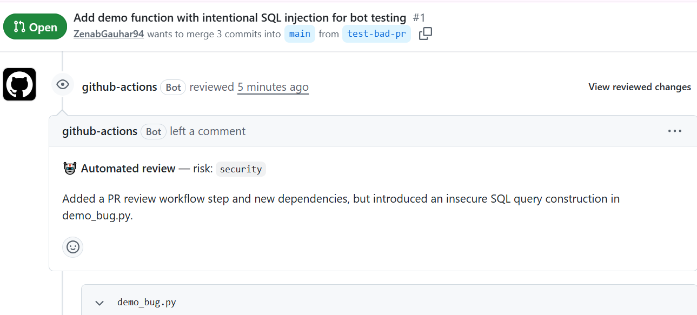

# AI PR Review Bot

A GitHub Action that automatically reviews pull requests: it parses the diff,
runs static analysis (`ruff`), sends both to an LLM with a schema-constrained
prompt, and posts the results back as inline PR comments.

Unlike a simple "paste the diff into an LLM" script, this project is built
as a small pipeline with validated structured output and a measured eval
set — see [Evaluation](#evaluation) below.

## Demo


## How it works

PR opened/updated
│
▼
GitHub Action triggers ──► fetch PR diff (GitHub REST API)
│
▼
diff_parser.py ──► structured per-file, per-line diff
│ (real file line numbers, not diff-relative ones)
▼
static_analysis.py ──► ruff findings on changed .py files
│
▼
llm_review.py ──► LLM call (GPT-OSS 120B via Groq's free API),
│ forced to return JSON matching a pydantic schema
▼
github_client.py ──► posts a PR review with inline comments


## Why this design

- **Real file line numbers, computed by us, not the model.** LLMs are
  unreliable at mapping "line 7 of this diff hunk" back to a real file line.
  `diff_parser.py` computes that deterministically while parsing the unified
  diff, so the model only ever has to report a number it's shown directly.
- **Structured output, not free text.** The model is forced to return JSON
  matching a `pydantic` schema (severity, category, confidence, line). This
  is what makes the output usable by a pipeline instead of just readable by
  a human — it's the difference between "review" and "reviewer bot."
- **Linter findings feed into the prompt.** Anything `ruff` reliably catches
  shouldn't cost LLM tokens or risk a hallucinated miss. The model is
  instructed to build on the linter's findings, not repeat them.
- **Provider-agnostic LLM call.** Uses Groq's free, OpenAI-compatible API
  (no credit card required) rather than a provider-specific SDK. Swapping
  models or providers later means changing two constants in one file, not
  rewriting the pipeline.
- **Dry-run mode + eval harness.** `--dry-run` never posts to GitHub, which
  is what makes automated evaluation possible (see below).

## Evaluation

`eval/` contains a small hand-labeled set of diffs, each with a known,
deliberately injected issue (a SQL injection, an off-by-one bug, and one
clean diff to check for false positives). `eval/run_eval.py` runs the full
pipeline against each and reports precision/recall against the labels.

```bash
python eval/run_eval.py
```

Recall: 100% (2/2 known injected issues caught)
Precision: 40% (2/5 flagged issues were exact matches to labels)


The recall is a clean 100% — both injected bugs (a SQL injection and an
off-by-one loop bound) were caught on the correct line and category.
Precision looks lower at a glance, but breaking down the "misses" is more
informative than the raw number:

- **2 of the 3 "extra" flags were legitimate additional findings** not in
  my original ground-truth labels — e.g. on the off-by-one diff, the model
  also caught a related floor-division edge case in a neighboring function
  that I hadn't labeled as an expected finding.
- **1 was a genuine model hallucination**, caught by manual verification:
  the model claimed a UTF-8 ellipsis character (`…`) was "mis-encoded" on a
  clean diff. I checked the raw bytes (`\xe2\x80\xa6` — correct UTF-8) and
  confirmed the file was fine. This is now a documented failure mode, not a
  silent one.

This is intentionally a small, simple eval, not a research-grade benchmark —
the point is establishing *measured, spot-checked* signal on accuracy
instead of "I tried it on a few PRs and it looked fine."

## Setup

### 1. Clone and install

```bash
git clone https://github.com/YOUR_USERNAME/pr-review-bot.git
cd pr-review-bot
python -m venv venv
venv\Scripts\Activate.ps1        # Mac/Linux: source venv/bin/activate
pip install -r requirements.txt
```

### 2. Local testing (no GitHub required)

```bash
$env:GROQ_API_KEY="gsk_..."      # get a free key at console.groq.com/keys
python -m pr_reviewer.main --diff-file eval/sample_diffs/sql_injection.diff
```

This prints the structured review JSON to stdout — no network calls to
GitHub, no repo needed.

### 3. Run the eval

```bash
python eval/run_eval.py
```

### 4. Run unit tests

```bash
pytest tests/ -v
```

### 5. Deploy as a GitHub Action on your own repo

1. Copy `.github/workflows/pr-review.yml` and the `pr_reviewer/` folder into
   the repo you want reviewed.
2. In that repo's Settings → Secrets and variables → Actions, add a secret
   `GROQ_API_KEY`. (`GITHUB_TOKEN` is provided automatically by Actions.)
3. Open a pull request — the bot reviews it automatically.

## Project structure

pr_reviewer/
diff_parser.py # unified diff → structured, line-numbered data
static_analysis.py # ruff wrapper
llm_review.py # LLM call (Groq) + structured output parsing
github_client.py # GitHub REST API: fetch diff, post review
schemas.py # pydantic models for the LLM's structured output
main.py # orchestration / GitHub Action entrypoint
eval/
sample_diffs/ # hand-crafted diffs with known injected issues
eval_set.json # ground-truth labels
run_eval.py # precision/recall harness
tests/
test_diff_parser.py # unit tests for the diff parser
.github/workflows/
pr-review.yml # the Action itself


## Known limitations / what I'd build next

- Only lints Python via `ruff`; a multi-language repo would need per-
  language static analysis tools wired in.
- The eval set is small (3 cases) — a real next step would be scraping a
  sample of historical PRs with known post-merge bugfixes as negative/
  positive examples, to get a larger, more representative eval set.
- LLM output isn't perfectly deterministic — re-running the same diff can
  produce slightly different line/category attribution. Worth adding
  temperature=0 and/or majority-vote across multiple calls for
  production use.
- No caching/dedup — if a PR is updated twice quickly, it re-reviews the
  full diff both times rather than diffing against the previous review.
- `post_review` always uses `event: "COMMENT"` rather than
  `REQUEST_CHANGES`, by design (a false positive shouldn't block a merge),
  but that's a product decision worth revisiting with real usage data.

## Stack

Python 3.11 · GPT-OSS 120B via Groq (free, OpenAI-compatible API) ·
`pydantic` for schema validation · `ruff` for static analysis ·
GitHub REST API · GitHub Actions


